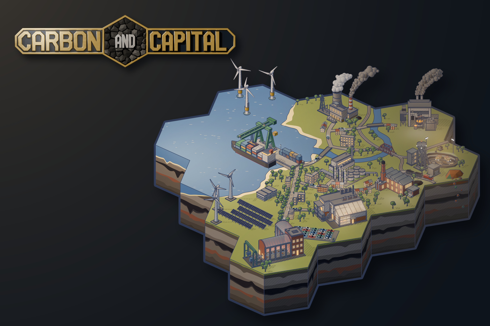
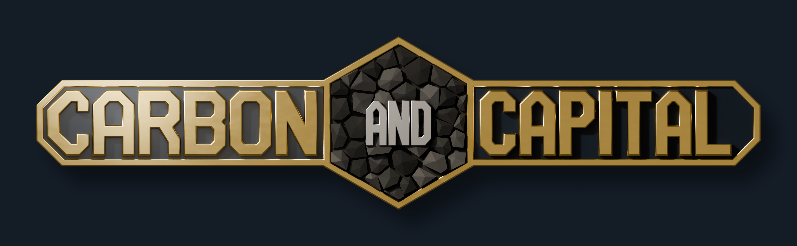
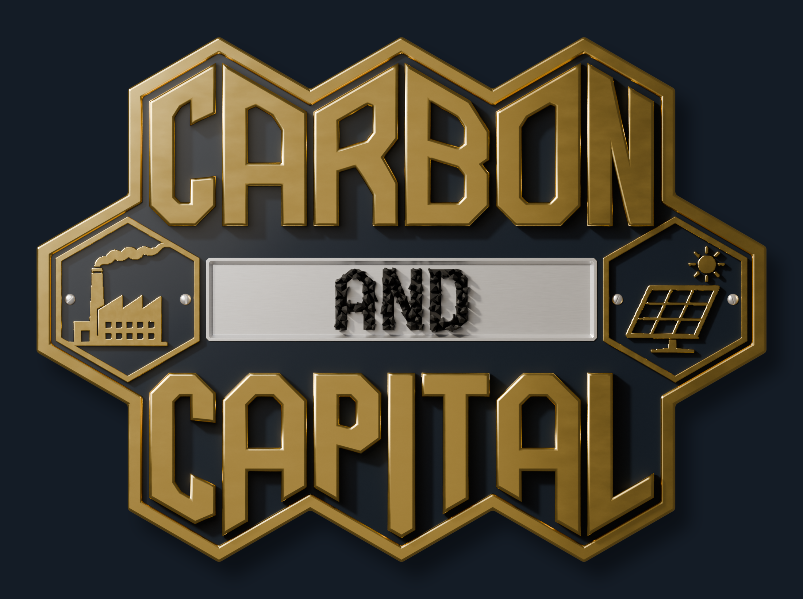
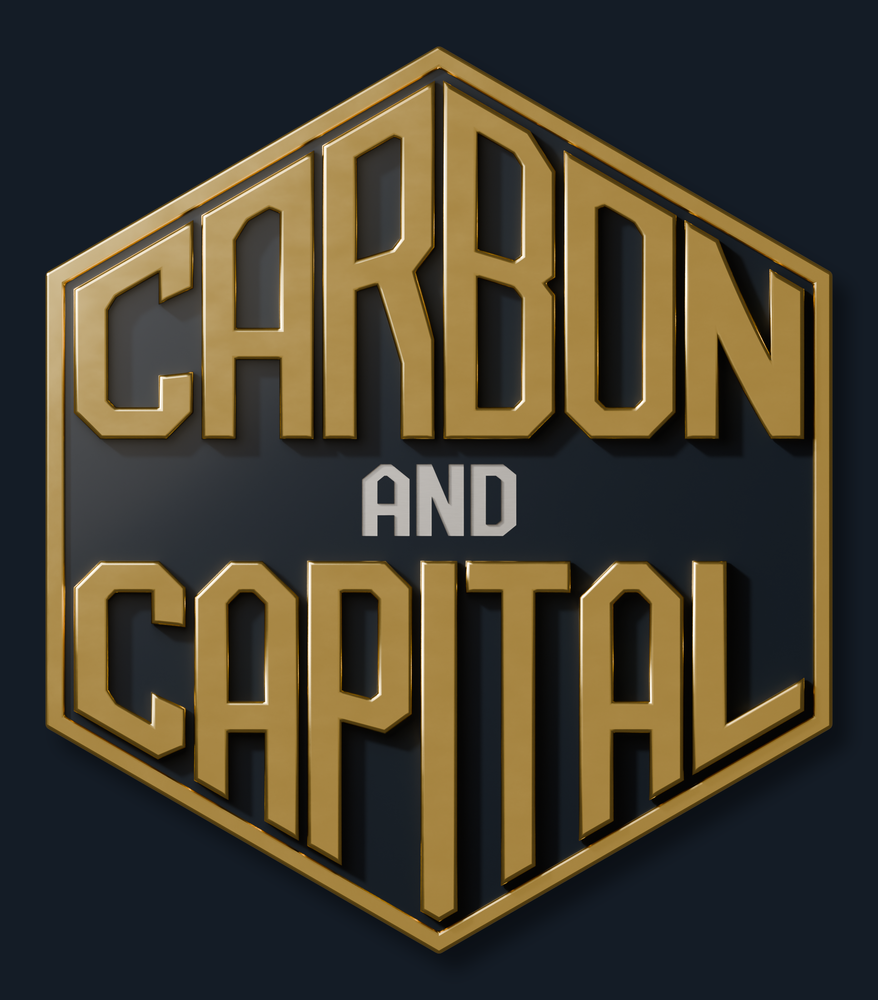
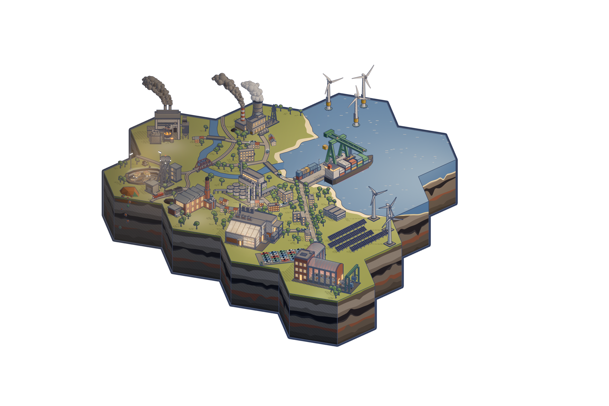
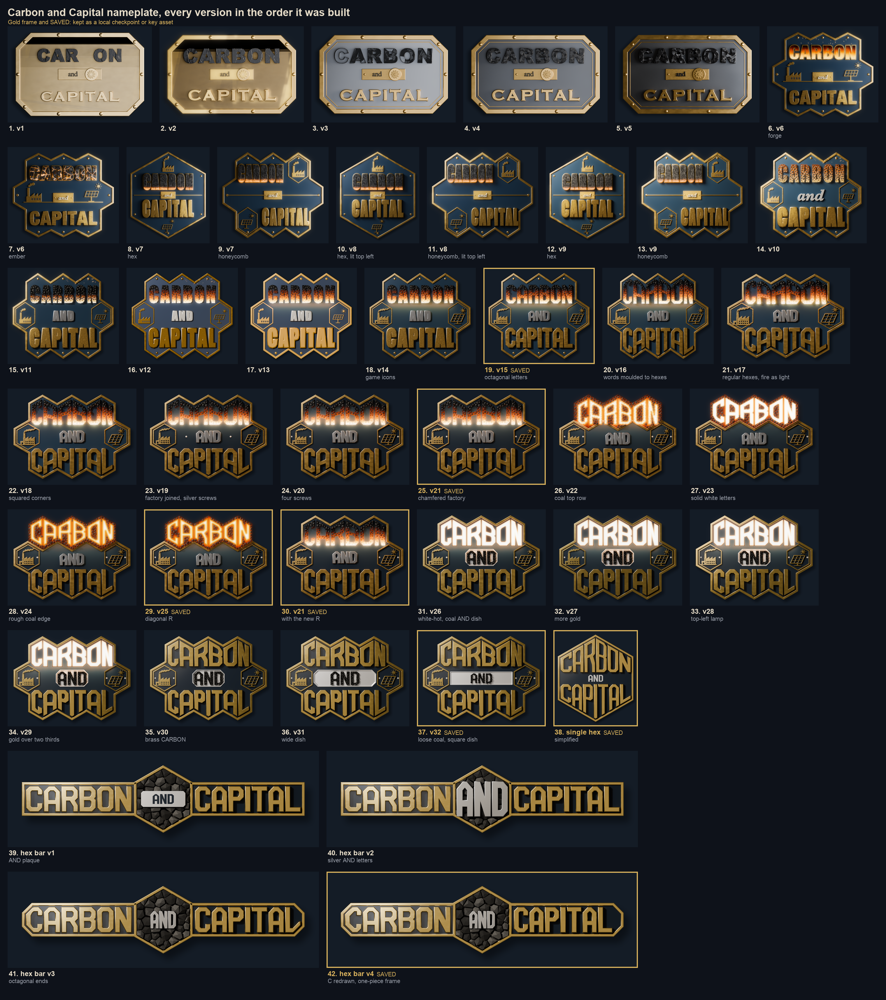

# Carbon and Capital: Steam key art and nameplate

This folder builds the key art for the game's Steam store page in Blender: a diorama of the
game's world (the map) and the game's nameplate (the logo), then lays the two together as a
capsule mock-up. Everything is made by the scripts here, from the game's own building
sprites and icons, so it can be re-rendered at any size a Steam asset needs. The README
covers each script in detail; this note explains what was built, the decisions behind it,
and what is still open.



## Where it ended up

- **Nameplate, the key asset: the hex bar.** CARBON and CAPITAL in raised brass on two navy
  plates with octagonal ends, either side of a regular hex filled with coal, with AND in
  silver on the coal. One brass rim runs round the whole piece.
  
- **Two alternatives kept in reserve:** the honeycomb badge (the emblem's honeycomb plate:
  CARBON over loose coal AND in a silver dish over CAPITAL, with the factory and solar farm
  icons) and a single hex (CARBON over stamped silver AND over CAPITAL).
   
- **The map:** the game's world on a block of hex tiles, cut away to show the strata below,
  in the golden look.
  

## The map

A sea bay with a container port in front, a town along the river, and industry running
back to the coal mine:

- **Port:** a container ship under a gantry crane, its spreader over the containers.
- **Power:** a coal power station with its cooling tower, wind turbines on land and offshore,
  and a solar farm.
- **Works:** an electric arc furnace steelworks, a chemical plant by the river with
  pipelines running into the ground, a high-tech manufactory, and an EV assembly plant with
  a lot of finished cars and a charger.
- **The mine:** headframe and offices, an open pit with lit haul trucks and light masts, a
  coal train on the line between the mine and the works, a coal heap, and a copper heap with
  its seam showing in the cut-away below.
- **Town:** terraces and flats, trees along the roads, cars on the roads with white
  headlamps and red tail lamps.

The buildings are the game's own sprite models at level 3, built by the
`blender-building-sprites` skill's builders. The camera is the sprites' true-isometric rig,
and the image goes through the same print pass as the game's sprites: flat colour, ink
outlines and stipple shading. That way the key art looks like the game.

**Lighting.** It uses the golden look: a warm low sun, and a haze of smoke darkening the
north-west over the mine. It warms to golden light off the sea, where a real light source
over the bay puts glints on the water. Windows, halls, the pit and the roads carry their own
lamps. The map is rendered with its light coming from the right; the composition mirrors it
so the light comes from the top left, as it does on the nameplate. The solar panels are
mirrored to match, so that in the composition they face the sun.

## How the nameplate got here



Forty-two versions, in seven stretches:

1. **v1 to v5: a diegetic metal plate.** An octagonal plate with black, blocky coal letters
   in relief, lit from the right, with room for one icon by "and".
2. **v6 to v9: fire, and the emblem's plate.**
   - CARBON tried as a window into a forge, then as ember-cracked coal.
   - The plate became the game emblem's navy and brass, as a single hex or as a honeycomb.
   - The light moved to the top left, to match the mirrored map.
3. **v10 to v15: coal letters and the game's icons.**
   - CARBON built from lumps of coal over a glowing bed, white-hot at the feet.
   - AND in brushed silver capitals.
   - The factory and solar farm are the game's own icons, keyed and traced, then raised in
     brass.
   - An octagonal alphabet was drawn for the words, every curve a 45-degree chamfer.
4. **v16 to v21: shaped to the hexes.**
   - The words were moulded to their rows, CARBON's tops rising to the hex points and
     CAPITAL's feet dropping to them.
   - The hexes were made regular.
   - The fire became a real light source on the plate.
   - The factory icon was fused to its frame.
5. **v22 to v25: a burning top row.** The top three hexes became a slab of coal with
   CARBON burning in it, and the R got a diagonal leg so it no longer reads as an A.
6. **v26 to v32: readable at Steam's sizes.**
   - A player found the glowing and coal CARBON hard to read, especially its top half.
   - CARBON went white-hot, then plain brass to match CAPITAL.
   - AND became loose coal in a silver dish.
   - The lighting was reworked so the brass reads gold right across the plate.
7. **Simpler shapes.** A single hex, then the hex bar, which became the key asset.

The versions marked SAVED on the sheet were kept as checkpoints.

## Decisions worth keeping

- **Test at Steam's smallest sizes.** The small capsule is also shown at 184×69 and 120×45
  in search results and lists. Glowing, textured letters blur there, and plain brass on navy
  stays legible. That test drove the move away from the coal letters.
- **Lighting polished metal seen head-on.** A fully metallic flat face seen straight on
  reflects only what is above it. The brass therefore reads gold under a broad lamp hung
  over it, set to light only the brass (light linking). Without that lamp it reads dark, and
  lit by the general lights it bleaches to cream.
- **Fire as light.** Glowing letters cast real light: their emission is boosted for every
  ray but the camera's, and hidden lamps sit just above them so the light carries across the
  plate. Shadow linking stops the glowing parts throwing the sun's shadows.
- **Draw outlines yourself.** Blender's curve offset closed up the small counters in B and
  filled them, and the hex bar's C needed an even stroke round octagonal corners. Both are
  drawn as explicit polygons in `nameplate.py`.
- **One piece of brass for joined frames.** Separately bevelled rims pinch where they meet
  and leave dark holes, so the hex bar's rim and dividers are a single bevelled shape.

## Steam asset coverage

| Asset | Size | From the logo and map |
|---|---|---|
| Header capsule, library header | 920×430 | Yes |
| Main capsule | 1232×706 | Yes |
| Small capsule | 462×174 (also 184×69, 120×45) | Yes; the hex bar suits its wide shape |
| Vertical capsule, library capsule | 748×896, 600×900 | Yes; the badge nameplates suit these tall shapes better than the hex bar |
| Library logo | 1280×720, transparent | Yes; the nameplate renders on transparency |
| Library hero | 3840×1240, no text | Partly; the map needs a wider backdrop |
| Page background, event cover and header | 1438×810; 800×450, 1920×622 | Yes |
| Shortcut and app icons | 256×256, 184×184 | No; needs a simple mark that reads at 32 px |
| Screenshots and trailer | 1920×1080 | No; Steam wants gameplay |

## Reproducing it

Blender runs headless (`blender -b`). Give Blender absolute output paths. From the repo root:

```
# the map, in the golden look, then its print pass
blender -b --factory-startup --python tools/steam_capsule/render_earth_plate.py -- \
    --out "$PWD/tools/steam_capsule/renders/earth_plate.png" --res 3072x2048 --look golden
python3 tools/steam_capsule/finish_render.py tools/steam_capsule/renders/earth_plate.png --shadows

# the hex bar nameplate, laid on navy
blender -b --factory-startup --python tools/steam_capsule/nameplate.py -- --plate hexbar \
    --light topleft --res 3300x1020 --out "$PWD/tools/steam_capsule/renders/nameplate.png"
python3 tools/steam_capsule/nameplate_finish.py tools/steam_capsule/renders/nameplate.png

# the two together
python3 tools/steam_capsule/compose_capsule.py tools/steam_capsule/renders/earth_plate_print.png \
    tools/steam_capsule/renders/nameplate.png tools/steam_capsule/renders/mock.png \
    --mirror --map-width 0.667 --plate-at tl
```

The map needs the shared sprite kit (`blender-assets/sprite_kit.py`, outside this repo; see
the `blender-building-sprites` skill). For the alternatives, use `--plate honeycomb-wide`
for the honeycomb badge or `--plate single` for the single hex. The README lists every
option.

## What is not in the repo

The saved Blender scenes, the full render history and the comparison images stay on the
owner's machine. The scripts regenerate every image. The few images here are the final key
art and the version sheet.

## Open

- Choose between the hex bar and the two badges, or keep one per slot: the bar for wide
  slots, a badge for tall ones.
- An icon mark for the shortcut and app icons.
- A wider backdrop for the library hero.
- The words use a custom octagonal alphabet drawn in `nameplate.py`, so the lettering does
  not depend on a typeface; the scripts still load Mac system fonts for older options.
